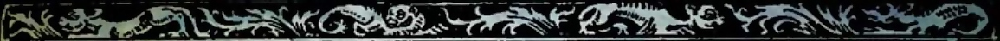

<script>
!--    google analytics-->

  (function(i,s,o,g,r,a,m){i['GoogleAnalyticsObject']=r;i[r]=i[r]||function(){
  (i[r].q=i[r].q||[]).push(arguments)},i[r].l=1*new Date();a=s.createElement(o),
  m=s.getElementsByTagName(o)[0];a.async=1;a.src=g;m.parentNode.insertBefore(a,m)
  })(window,document,'script','https://www.google-analytics.com/analytics.js','ga');

  ga('create', 'UA-74338484-2', 'auto');
  ga('send', 'pageview');

</script>


## Descripción del seminario


El objetivo general de este seminario es examinar los métodos, las metodologías, las habilidades, competencias y capacidades para investigar en el campo que comprende la unión de las ciencias experimentales, sociales y humanas dentro de lo que usualmente se conoce como *interdisciplinariedad*. Estudiaremos la idea de una disciplina, su forma de investigar y cómo se puede caracterizar la investigación que no se ajusta a tales maneras. En el contexto de la Maestría en Teología, la idea es ofrecer al estudiante las bases para una investigación que no solo abarque las diversas áreas de la Teología, sino también de las ciencias sociales, humanas y experimentales.

Discutiremos los valores de una disciplina, la forma en que las metodologías propias de una disciplina deben relacionarse con otras, la noción de evidencia, la relación entre la investigación, el sujeto y el objeto de estudio, la necesidad de la neutralidad en la investigación y la relación de la investigación académica con los llamados “problemas reales”.  

Para ello, primero examinaremos el rol general de la discusión epistemológica en la maestría y hablaremos sobre sus disciplinas bases, aquellas que estudiaron durante su pregrado o la mayor parte de sus estudios, en la que se han desempeñado principal o con la que mejor se identifican. Después utilizaremos un cuestionario para guiar la discusión sobre la forma en que se investiga en cada una de sus disciplinas (basado en Hubbs, G., O'Rourke, M., & Orzack, S. H. (2020)) y la manera en que creen que esto enmarca también su futura investigación a lo largo de la Maestría en Teología. Posteriormente, discutiremos la tensión en la investigación disciplinar y su aplicabilidad a los “problemas reales”. (De paso, discutiremos también la idoneidad de la noción de “problemas reales”). Para finalizar hablaremos sobre la idea misma de la disciplinariedad y las formas en que podemos caracterizar la diferencias con la interdisciplinariedad, transdisciplinariedad y multidisciplinariedad y otras formas de investigación por fuera de los esquemas presentados por una disciplina. Terminaremos con un retorno al cuestionario inicial con miras a determinar la forma en que su aproximación a la investigación ha cambiado a luz del seminario y la forma en que formularía una investigación dentro del marco epistemológico presentado. 
 
**Profesor**: [Juan Camilo Espejo-Serna](../index.html)\ 

**Página web**: http://jcunisabana.github.io/epistemologia

**Horario**: Lunes 18 - Sábado 23, Enero 2021, 4:00 - 6:00 pm

**Grupo de MS Teams**: [Aquí](https://teams.microsoft.com/l/team/19%3a47148dea91c344d3b1ef43d15d45fa29%40thread.tacv2/conversations?groupId=71020fbe-eba5-41d3-a820-ca568eca3871&tenantId=aca51631-00fe-490d-91ab-163ef87260ee)




## Objetivos

- Dominar el lenguaje propio de la discusión filosófica sobre la ciencia para aportar en las discusiones sobre la naturaleza de la ciencia, del progreso científico y su lugar en la sociedad.

- Distinguir, relacionar y sistematizar conocimientos aportados por la ciencia específicas y la filosofía para dar cuenta de la naturaleza de la ciencia, del progreso científico y su lugar en la sociedad.						

- Plantear autónoma y críticamente relaciones entre distintos fenómenos científicos para interpretarlos y establecer vínculos entre el conocimiento teórico y la práctica científica.

- Utilizar TIC para apoyar el estudio filosófico de la ciencia.


## Metodología


#### **Antes de la sesión**

- Todos los estudiantes deberán subir un control de lectura por tarde **75 horas** antes de la sesión.

#### **Durante la sesión**

- Todos deben atender con cuidado a la presentación del profesor y formular preguntas al respecto. Los controles de lectura transforman la clase en la medida en que las presentaciones se irán ajustando a lo que ustedes reflejen en los controles de lectura.

- Revisen si entienden la exposición y si están de acuerdo; pregunten por las relaciones con los temas anteriormente expuestos.


## Plan semanal 

`r Semana <- 1`


### Semana `r Semana`

```{r echo=FALSE}
library(readxl)
library(knitr)
library(kableExtra)

PlanSemanal <-  read_excel("HFC.xlsx",sheet = "info")
Notas <- read_excel("HFC.xlsx", sheet = "notas")

  kable(PlanSemanal[Semana, c(5,6)]) %>%kable_styling(bootstrap_options = c("striped", "hover"), position = "left")%>%
  column_spec(1:2, width = "30em")
```

<iframe width="100%" height="400" align="middle" src="1.html" border="0">
</iframe>
<a href="1.html">Presentación en pantalla completa</a>


---
`r Semana <- Semana +1`

### Semana `r Semana`

```{r echo=FALSE}

  kable(PlanSemanal[Semana, c(5,6)]) %>%kable_styling(bootstrap_options = c("striped", "hover"), position = "left")%>%
  column_spec(1:2, width = "30em")

```

- Leer: `r PlanSemanal$Texto[Semana]`

- Hacer: Control de lectura `r if(!(is.na(PlanSemanal$Recordatorio[Semana]))) paste("y ", PlanSemanal$Recordatorio[Semana]) `

<iframe width="100%" height="400" align="middle" src="2.html" border="0">
</iframe>
<a href="2.html">Presentación en pantalla completa</a>

---
`r Semana <- Semana +1`

### Semana `r Semana`

```{r echo=FALSE}

  kable(PlanSemanal[Semana, c(5,6)]) %>%kable_styling(bootstrap_options = c("striped", "hover"), position = "left")%>%
  column_spec(1:2, width = "30em")

```

- Leer: `r PlanSemanal$Texto[Semana]`

- Hacer: Control de lectura `r if(!(is.na(PlanSemanal$Recordatorio[Semana]))) paste("y ", PlanSemanal$Recordatorio[Semana]) `

<iframe width="100%" height="400" align="middle" src="3.html" border="0">
</iframe>
<a href="3.html">Presentación en pantalla completa</a>

---
`r Semana <- Semana +1`

### Semana `r Semana`

```{r echo=FALSE}

  kable(PlanSemanal[Semana, c(5,6)]) %>%kable_styling(bootstrap_options = c("striped", "hover"), position = "left")%>%
  column_spec(1:2, width = "30em")

```

- Leer: `r PlanSemanal$Texto[Semana]`

- Hacer: Control de lectura `r if(!(is.na(PlanSemanal$Recordatorio[Semana]))) paste("y ", PlanSemanal$Recordatorio[Semana]) `

<iframe width="100%" height="400" align="middle" src="4.html" border="0">
</iframe>
<a href="4.html">Presentación en pantalla completa</a>


---
`r Semana <- Semana +1`

### Semana `r Semana`

```{r echo=FALSE}

  kable(PlanSemanal[Semana, c(5,6)]) %>%kable_styling(bootstrap_options = c("striped", "hover"), position = "left")%>%
  column_spec(1:2, width = "30em")

```

- Leer: `r PlanSemanal$Texto[Semana]`

- Hacer: `r if(!(is.na(PlanSemanal$Recordatorio[Semana]))) paste("", PlanSemanal$Recordatorio[Semana]) `

<iframe width="100%" height="400" align="middle" src="4.html" border="0">
</iframe>
<a href="4.html">Presentación en pantalla completa</a>

---
`r Semana <- Semana +1`

### Semana `r Semana`

```{r echo=FALSE}

  kable(PlanSemanal[Semana, c(5,6)]) %>%kable_styling(bootstrap_options = c("striped", "hover"), position = "left")%>%
  column_spec(1:2, width = "30em")

```

- Leer: `r PlanSemanal$Texto[Semana]`

- Hacer: Control de lectura `r if(!(is.na(PlanSemanal$Recordatorio[Semana]))) paste("y ", PlanSemanal$Recordatorio[Semana]) `


<iframe width="100%" height="400" align="middle" src="6.html" border="0">
</iframe>
<a href="6.html">Presentación en pantalla completa</a>


---
`r Semana <- Semana +1`

### Semana `r Semana`

```{r echo=FALSE}

  kable(PlanSemanal[Semana, c(5,6)]) %>%kable_styling(bootstrap_options = c("striped", "hover"), position = "left")%>%
  column_spec(1:2, width = "30em")

```

- Leer: `r PlanSemanal$Texto[Semana]`

- Hacer: Control de lectura `r if(!(is.na(PlanSemanal$Recordatorio[Semana]))) paste("y ", PlanSemanal$Recordatorio[Semana]) `


<iframe width="100%" height="400" align="middle" src="6.html" border="0">
</iframe>
<a href="6.html">Presentación en pantalla completa</a>


---
`r Semana <- Semana +1`

### Semana `r Semana`

```{r echo=FALSE}

  kable(PlanSemanal[Semana, c(5,6)]) %>%kable_styling(bootstrap_options = c("striped", "hover"), position = "left")%>%
  column_spec(1:2, width = "30em")

```

- Leer: `r PlanSemanal$Texto[Semana]`

- Hacer: Control de lectura `r if(!(is.na(PlanSemanal$Recordatorio[Semana]))) paste("y ", PlanSemanal$Recordatorio[Semana]) `


<iframe width="100%" height="400" align="middle" src="6.html" border="0">
</iframe>
<a href="6.html">Presentación en pantalla completa</a>


---
`r Semana <- Semana +1`

### Semana `r Semana`

```{r echo=FALSE}

  kable(PlanSemanal[Semana, c(5,6)]) %>%kable_styling(bootstrap_options = c("striped", "hover"), position = "left")%>%
  column_spec(1:2, width = "30em")

```

- Leer: `r PlanSemanal$Texto[Semana]`

- Hacer: Control de lectura `r if(!(is.na(PlanSemanal$Recordatorio[Semana]))) paste("y ", PlanSemanal$Recordatorio[Semana]) `


<iframe width="100%" height="400" align="middle" src="8.html" border="0">
</iframe>
<a href="8.html">Presentación en pantalla completa</a>


`r Semana <- Semana +1`


---

### Semana `r Semana`

```{r echo=FALSE}

  kable(PlanSemanal[Semana, c(5,6)]) %>%kable_styling(bootstrap_options = c("striped", "hover"), position = "left")%>%
  column_spec(1:2, width = "30em")

```

- Leer: `r PlanSemanal$Texto[Semana]`

- Hacer: Control de lectura `r if(!(is.na(PlanSemanal$Recordatorio[Semana]))) paste("y ", PlanSemanal$Recordatorio[Semana]) `


<iframe width="100%" height="400" align="middle" src="9.html" border="0">
</iframe>
<a href="9.html">Presentación en pantalla completa</a>

---
`r Semana <- Semana +1`

### Semana `r Semana`

```{r echo=FALSE}

  kable(PlanSemanal[Semana, c(5,6)]) %>%kable_styling(bootstrap_options = c("striped", "hover"), position = "left")%>%
  column_spec(1:2, width = "30em")

```

- Leer: `r PlanSemanal$Texto[Semana]`

- Hacer: Control de lectura `r if(!(is.na(PlanSemanal$Recordatorio[Semana]))) paste("y ", PlanSemanal$Recordatorio[Semana]) `


<iframe width="100%" height="400" align="middle" src="10.html" border="0">
</iframe>
<a href="10.html">Presentación en pantalla completa</a>

---
`r Semana <- Semana +1`

### Semana `r Semana`

```{r echo=FALSE}

  kable(PlanSemanal[Semana, c(5,6)]) %>%kable_styling(bootstrap_options = c("striped", "hover"), position = "left")%>%
  column_spec(1:2, width = "30em")

```

- Leer: `r PlanSemanal$Texto[Semana]`

- Hacer: Control de lectura `r if(!(is.na(PlanSemanal$Recordatorio[Semana]))) paste("y ", PlanSemanal$Recordatorio[Semana]) `


<iframe width="100%" height="400" align="middle" src="10.html" border="0">
</iframe>
<a href="10.html">Presentación en pantalla completa</a>


---
`r Semana <- Semana +1`

### Semana `r Semana`

```{r echo=FALSE}

  kable(PlanSemanal[Semana, c(5,6)]) %>%kable_styling(bootstrap_options = c("striped", "hover"), position = "left")%>%
  column_spec(1:2, width = "30em")

```

<iframe width="100%" height="400" align="middle" src="11.html" border="0">
</iframe>
<a href="11.html">Presentación en pantalla completa</a>

---
`r Semana <- Semana +1`

### Semana `r Semana`

```{r echo=FALSE}

  kable(PlanSemanal[Semana, c(5,6)]) %>%kable_styling(bootstrap_options = c("striped", "hover"), position = "left")%>%
  column_spec(1:2, width = "30em")

```

- Leer: `r PlanSemanal$Texto[Semana]`

- Hacer: Control de lectura `r if(!(is.na(PlanSemanal$Recordatorio[Semana]))) paste("y ", PlanSemanal$Recordatorio[Semana]) `


<iframe width="100%" height="400" align="middle" src="11.html" border="0">
</iframe>
<a href="11.html">Presentación en pantalla completa</a>


---
`r Semana <- Semana +1`

### Semana `r Semana`

```{r echo=FALSE}

  kable(PlanSemanal[Semana, c(5,6)]) %>%kable_styling(bootstrap_options = c("striped", "hover"), position = "left")%>%
  column_spec(1:2, width = "30em")

```

- Leer: `r PlanSemanal$Texto[Semana]`

- Hacer: Control de lectura `r if(!(is.na(PlanSemanal$Recordatorio[Semana]))) paste("y ", PlanSemanal$Recordatorio[Semana]) `


<iframe width="100%" height="400" align="middle" src="15.html" border="0">
</iframe>
<a href="15.html">Presentación en pantalla completa</a>


---
`r Semana <- Semana +1`

### Semana `r Semana`

```{r echo=FALSE}

  kable(PlanSemanal[Semana, c(5,6)]) %>%kable_styling(bootstrap_options = c("striped", "hover"), position = "left")%>%
  column_spec(1:2, width = "30em")

```

- Leer: `r PlanSemanal$Texto[Semana]`

- Hacer: Control de lectura `r if(!(is.na(PlanSemanal$Recordatorio[Semana]))) paste("y ", PlanSemanal$Recordatorio[Semana]) `


<iframe width="100%" height="400" align="middle" src="16.html" border="0">
</iframe>
<a href="16.html">Presentación en pantalla completa</a>


---
`r Semana <- Semana +1`

### Semana `r Semana`

```{r echo=FALSE}

  kable(PlanSemanal[Semana, c(5,6)]) %>%kable_styling(bootstrap_options = c("striped", "hover"), position = "left")%>%
  column_spec(1:2, width = "30em")

```

- Leer: `r PlanSemanal$Texto[Semana]`

- Hacer: Repasar todas las presentaciones `r if(!(is.na(PlanSemanal$Recordatorio[Semana]))) paste("y ", PlanSemanal$Recordatorio[Semana]) `


## Evaluación

#### **Talleres**

Los talleres consistirán en una serie de preguntas que los alumnos deberán solucionar en la plataforma virtual. Es deber del estudiante entender bien cómo funciona la plataforma con anticipación a la fecha límite de entrega del taller.

#### **Control de lectura**
Extensión: entre 400 y 1000 palabras.

Para cada lectura asignada, los estudiantes deben escribir un texto corto con la tesis principal, tres afirmaciones/presuposiciones del texto y tres preguntas/desafíos al texto. 

Los controles deberán ser subidos a la plataforma virtual a más tardar **75 horas** antes de la sesión. Todos los estudiantes empiezan con 5.0 en esta nota. Por cada vez que no se participe dentro del rango de tiempo especificado, la nota será disminuida de acuerdo con los siguientes parámetros: primera vez: -0.5; segunda vez: -1.0; tercera vez: -1.5; cuarta vez: -2.0.

#### **Incumplimiento**
<p style="color:white; background-color:indigo; padding: 5px;">
*La vida nos da sorpresas; sorpresas nos da la vida.* 
Por eso, todos tienen un control de lectura "de gracia". Es decir, pueden dejar de entregar uno sin problema; el primer control de lectura que les falte no cuenta. Por ejemplo, si no entregan un control de lectura y entregan todos los demás, su nota igual queda en 5.0.</p>


Para todo lo demás, es importante avisar al profesor. Hablemos. No me tienen que contar sus problemas personales pero es importante que si se encuentran en una situación en la que ven que no pueden cumplir con los requerimientos de clase me avisen con la mayor anticipación posible y encontremos un plan para solventar el problema en lo que respecta a la clase. Insisto: hablemos, no se pierdan **:)**. 


#### **Calificación**

```{r echo=FALSE}
library(knitr)
library(kableExtra)

  kable(Notas[1 ,c(2,3,5,6,8,9)]) %>%
  kable_styling(bootstrap_options = c("striped", "hover"), full_width = F, position = "left")
```


[//]: # (El c??digo de abajo sirve para generar los ID de todas las secciones y as?? poder hacer links autom??ticamente con los nombres de las secciones nada más. bonito.)
 
<script type="text/javascript">
  // When the document is fully rendered...
  $(document).ready(function() {
    // ...select all header elements...
    $('h1, h2, h3, h4, h5').each(function() {
      // ...and add an id to them corresponding to their 'titles'
      $(this).attr('id', $(this).html());
    });
  });
</script>


